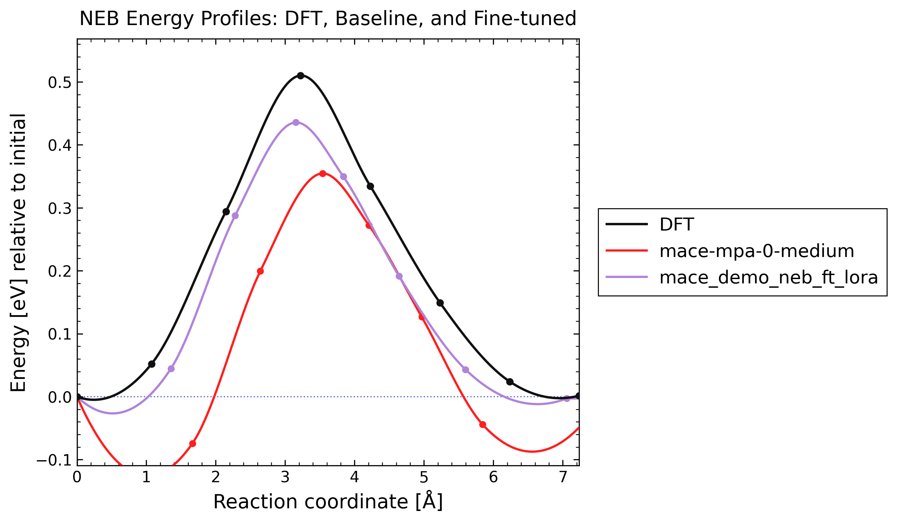
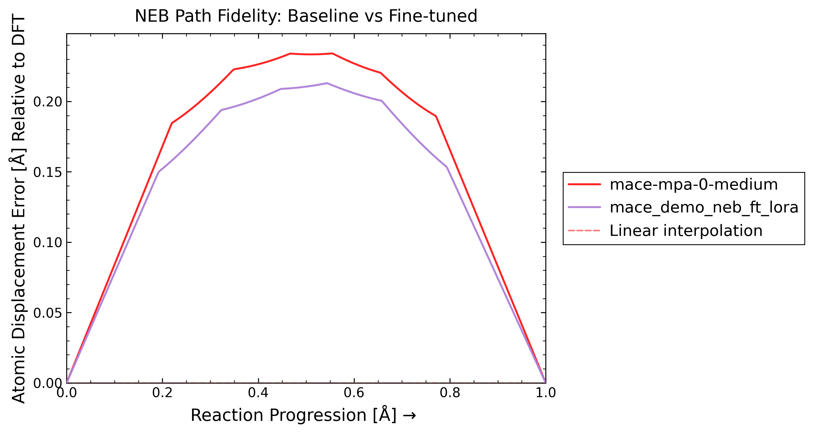

# MACE Workflow

This example follows one raw NEB problem all the way through curation,
fine-tuning, and a final benchmark that compares the original model against the
fine-tuned one on the same endpoints.

Step flow:

- `0_raw_inputs/` contains the raw NEB bundle and the `siv_rules.yml` file
  that defines the curation job
- `1_curated_data/` receives the curated `extxyz` splits written by the data
  curation command
- `2_train/` contains the launcher that reads those curated splits and runs
  MACE LoRA fine tuning
- `3_results/` collects the checkpoints, logs, and exported model artifacts
- `4_benchmark/` compares `mace-mpa-0-medium` against `mace_demo_neb_ft_lora`
  on the raw NEB pathway from `0_raw_inputs/output1`

Run curation from the repo root with:

```bash
mlip-ft mace --curate-neb --inputs demo/fine_tuning/mace/0_raw_inputs/siv_rules.yml
```

That command reads `demo/fine_tuning/mace/0_raw_inputs/siv_rules.yml` and
writes the curated `extxyz` files into:

```text
demo/fine_tuning/mace/1_curated_data/
```

Run training with:

```bash
./demo/fine_tuning/mace/2_train/run_fine_tuning.sh
```

That launcher is the family-local copy of:

```text
./src/fine_tuning/fine_tuning_scripts/mace/lora_fine_tuning_laptop.sh
```

It reads the curated `extxyz` files from `demo/fine_tuning/mace/1_curated_data/`
and writes all outputs into:

```text
demo/fine_tuning/mace/3_results/
```

After training, append the fine-tuned model name and its environment to
`SUPPORTED_MODELS.yml` for later benchmarking. The entry for this workflow is:

```yaml
mace_demo_neb_ft_lora:
  environment: mace_env
```

Then copy the final MACE model artifact into:

```text
assets/models/mace/
```

The benchmark step uses the raw NEB images from:

```text
demo/fine_tuning/mace/0_raw_inputs/output1/00/POSCAR
demo/fine_tuning/mace/0_raw_inputs/output1/07/POSCAR
```

It does not relax endpoints. The benchmark config lives in
`demo/fine_tuning/mace/4_benchmark/config.yml`, and the ordinary command is:

```bash
mlip-neb --inputs demo/fine_tuning/mace/4_benchmark
```

The benchmark section below is generated automatically by
`mlip-neb --inputs demo/fine_tuning/mace/4_benchmark --report-benchmark`.

## Benchmark Report
<!-- MLIP_BENCHMARK_START -->

The benchmark compares the baseline and fine-tuned models on the raw NEB input from `0_raw_inputs/output1`.

Command:

```bash
mlip-neb --inputs demo/fine_tuning/mace/4_benchmark --report-benchmark
```

Compared models:

- baseline: `mace-mpa-0-medium`
- fine-tuned: `mace_demo_neb_ft_lora`

Metrics:

| Model | Energy barrier abs err [eV] | Delta E abs err [eV] | Energy profile RMSE [eV] | Mean RMS displacement [A] | Max RMS displacement [A] | AUC RMS displacement [A] |
| --- | ---: | ---: | ---: | ---: | ---: | ---: |
| mace-mpa-0-medium | 0.155485 | 0.001486 | 0.123539 | 0.161451 | 0.234118 | 0.161855 |
| mace_demo_neb_ft_lora | 0.074501 | 0.004477 | 0.043406 | 0.144814 | 0.212906 | 0.145176 |

Plots:

### Energy



### Path fidelity



[Report](4_benchmark/plot/report.md)

<!-- MLIP_BENCHMARK_END -->
