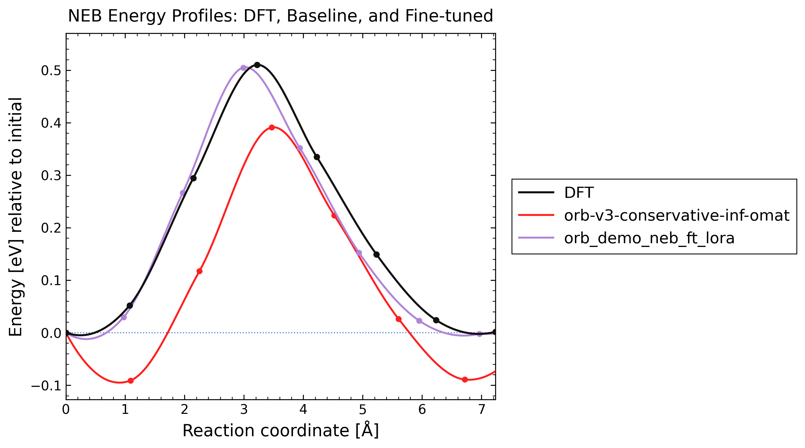
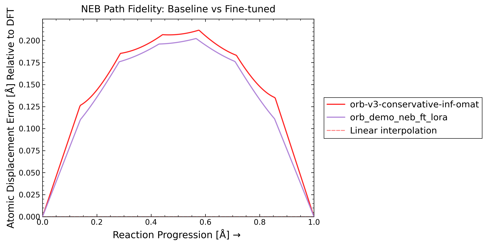

# ORB Workflow

This example follows one raw NEB problem all the way through curation,
fine-tuning, and a final benchmark that compares the original model against the
fine-tuned one on the same endpoints.

Step flow:

- `0_raw_inputs/` contains the raw NEB bundle and the `siv_rules.yml` file
  that defines the curation job
- `1_curated_data/` receives the ORB-ready ASE DB files written by `mlip-ft`
- `2_train/` contains the launcher that reads those DBs and runs ORB fine
  tuning
- `3_results/` collects the checkpoints and run artifacts
- `4_benchmark/` compares `orb-v3-conservative-inf-omat` against
  `orb_demo_neb_ft_lora` on the raw NEB pathway from `0_raw_inputs/output1`

Run curation from the repo root with:

```bash
mlip-ft orb --curate-neb --inputs demo/fine_tuning/orb/0_raw_inputs/siv_rules.yml
```

That command reads `demo/fine_tuning/orb/0_raw_inputs/siv_rules.yml` and
writes the curated ORB DB files into:

```text
demo/fine_tuning/orb/1_curated_data/
```

Run training with:

```bash
./demo/fine_tuning/orb/2_train/run_fine_tuning.sh
```

That launcher reads the curated DB files from `demo/fine_tuning/orb/1_curated_data/`
and writes all outputs into:

```text
demo/fine_tuning/orb/3_results/
```

After training, append the fine-tuned model name and its environment to
`SUPPORTED_MODELS.yml` for later benchmarking. The entry for this workflow is:

```yaml
orb_demo_neb_ft_lora:
  environment: mace_env2
```

Then copy the final ORB checkpoint into:

```text
assets/models/orb/
```

The benchmark step uses the raw NEB images from:

```text
demo/fine_tuning/orb/0_raw_inputs/output1/00/POSCAR
demo/fine_tuning/orb/0_raw_inputs/output1/07/POSCAR
```

It does not relax endpoints. The benchmark config lives in
`demo/fine_tuning/orb/4_benchmark/config.yml`, and the ordinary command is:

```bash
mlip-neb --inputs demo/fine_tuning/orb/4_benchmark
```

The benchmark section below is generated automatically by
`mlip-neb --inputs demo/fine_tuning/orb/4_benchmark --report-benchmark`.

## Benchmark Report
<!-- MLIP_BENCHMARK_START -->

The benchmark compares the baseline and fine-tuned models on the raw NEB input from `0_raw_inputs/output1`.

Command:

```bash
mlip-neb --inputs demo/fine_tuning/orb/4_benchmark --report-benchmark
```

Compared models:

- baseline: `orb-v3-conservative-inf-omat`
- fine-tuned: `orb_demo_neb_ft_lora`

Metrics:

| Model | Energy barrier abs err [eV] | Delta E abs err [eV] | Energy profile RMSE [eV] | Mean RMS displacement [A] | Max RMS displacement [A] | AUC RMS displacement [A] |
| --- | ---: | ---: | ---: | ---: | ---: | ---: |
| orb-v3-conservative-inf-omat | 0.119144 | 0.000350 | 0.113276 | 0.147483 | 0.211664 | 0.147852 |
| orb_demo_neb_ft_lora | 0.005184 | 0.003677 | 0.024695 | 0.137429 | 0.202214 | 0.137773 |

Plots:

### Energy



### Path fidelity



[Report](4_benchmark/plot/report.md)

<!-- MLIP_BENCHMARK_END -->
