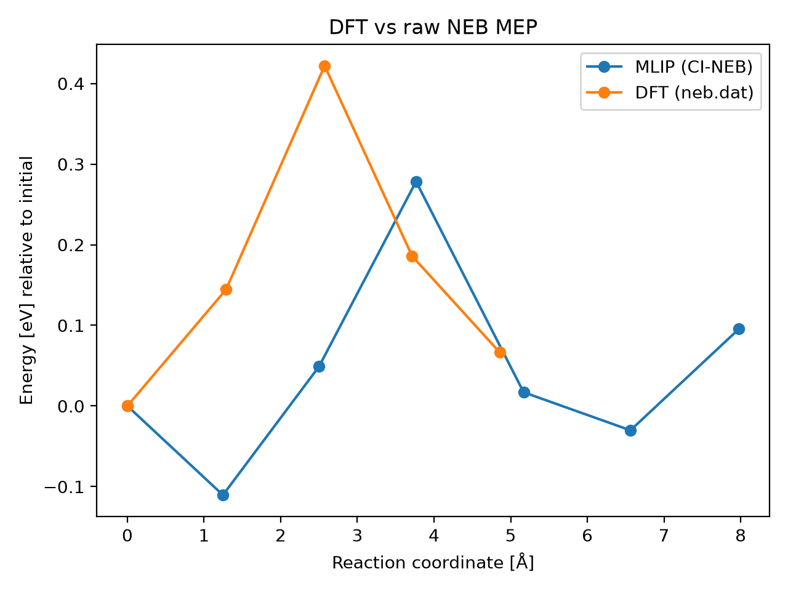

# DFT vs raw NEB MEP

## Metrics

- **mlip_barrier_eV**: 0.2783583574972681
- **mlip_deltaE_eV**: 0.09554995305336433
- **dft_barrier_eV**: 0.42191
- **dft_deltaE_eV**: 0.066483
- **energy_RMSE_eV**: 0.19937621940172665
- **Mlip dt**: 1.168141592920354
- **Mlip_d3 dt**: 1.3846153846153846
- **mlip_d3 climb dt**: 1.4181818181818182
- **Total NEB time (s)**: 324.0
- **max_F_perp_eV_per_A**: None
- **force_RMSE_eV_per_A**: None
- **max_force_err_eV_per_A**: None
- **model**: raw
- **raw_dir**: /home/uqctwee1/PhD_wsl/projects/mlip/mlip-workflows/neb_tests/g_CsPbI2Br/VI0/Pb57/8d-I4c/results_7imgs/raw
- **dft_neb_dat**: /home/uqctwee1/PhD_wsl/projects/mlip/mlip-workflows/neb_tests/g_CsPbI2Br/VI0/Pb57/8d-I4c/dft_neb.dat

## Plot

