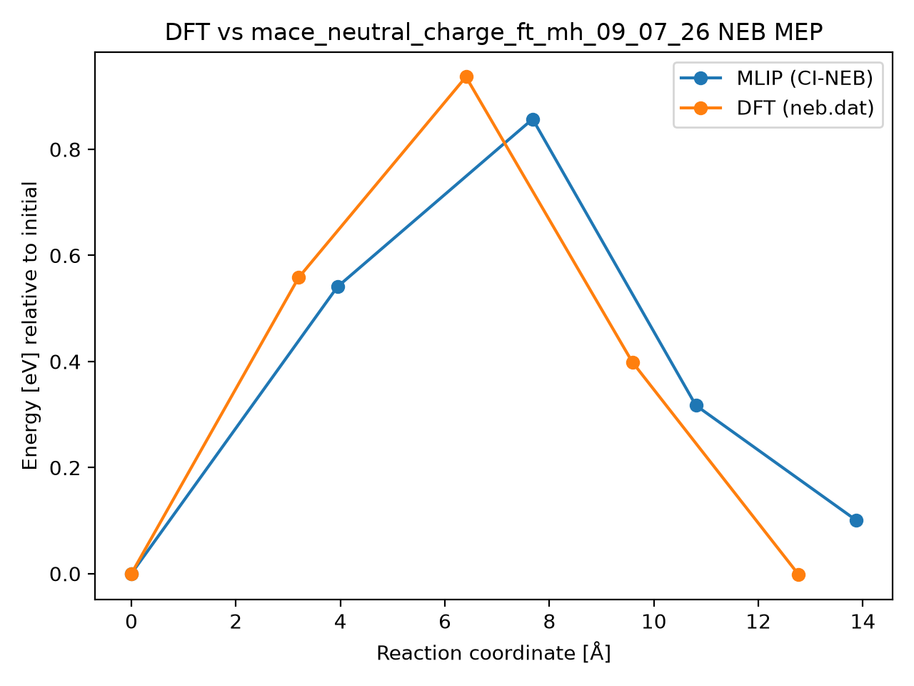

# DFT vs mace_neutral_charge_ft_mh_09_07_26 NEB MEP

## Metrics

- **mlip_barrier_eV**: 0.8572076041992318
- **mlip_deltaE_eV**: 0.10048574361979945
- **dft_barrier_eV**: 0.936799
- **dft_deltaE_eV**: -0.0019
- **energy_RMSE_eV**: 0.14033320193246052
- **Mlip dt**: None
- **Mlip_d3 dt**: None
- **mlip_d3 climb dt**: None
- **Total NEB time (s)**: None
- **max_F_perp_eV_per_A**: None
- **force_RMSE_eV_per_A**: None
- **max_force_err_eV_per_A**: None
- **model**: mace_neutral_charge_ft_mh_09_07_26
- **raw_dir**: /home/uqctwee1/PhD_wsl/projects/mlip/mlip-workflows/neb_tests/g_CsPbI2Br/VI0/Pb57_8d-Pb49_I8d/results_5img/raw
- **dft_neb_dat**: /home/uqctwee1/PhD_wsl/projects/mlip/mlip-workflows/neb_tests/g_CsPbI2Br/VI0/Pb57_8d-Pb49_I8d/neb.dat

## Plot

